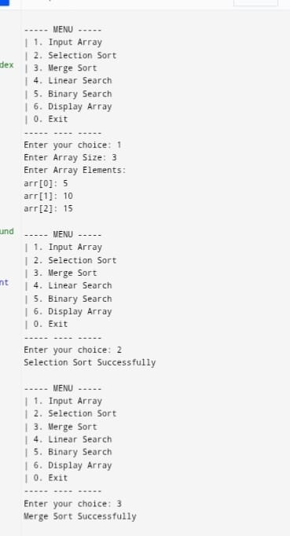

# 📊 Array Operations Project in C++

This is a console-based C++ project that demonstrates various fundamental array operations such as sorting, searching, and merging using object-oriented programming (OOP). It's perfect for students learning C++ data structures and algorithms.

## 🚀 Features

- ✅ Input array elements
- 🔁 Display array elements
- 📌 Selection Sort
- 🔀 Merge Sort
- 🔍 Linear Search
- 🔎 Binary Search

## 🧠 Concepts Covered

- Classes and Objects
- Encapsulation (Private members)
- Sorting Algorithms:
  - Selection Sort
  - Merge Sort
- Searching Algorithms:
  - Linear Search
  - Binary Search
- Modular Programming

## 📂 File Structure

Project/
│
├── main.cpp # Contains full implementation
└── README.md # You're here!

📋 Menu Options
Once the program runs, you'll see a menu like this:

----- MENU -----
| 1. Input Array
| 2. Selection Sort
| 3. Merge Sort
| 4. Linear Search
| 5. Binary Search
| 6. Display Array
| 0. Exit
----- ---- -----

## 🖼️ Screenshots  

### 🎯 Main Output  

🛠 Example Operations
Input Array: Add values to work with

Selection Sort: Sorts the array using the selection algorithm

Merge Sort: Recursively divides and sorts using merge

Linear Search: Searches for a value by checking each element

Binary Search: Searches faster in a sorted array

📎 Dependencies
A C++ compiler (like g++)

Works on all major platforms (Windows, Linux, macOS)

🙌 Credits
Developed by Sahil Nerpagar as part of learning and practicing sorting and searching algorithms in C++ DSA.
