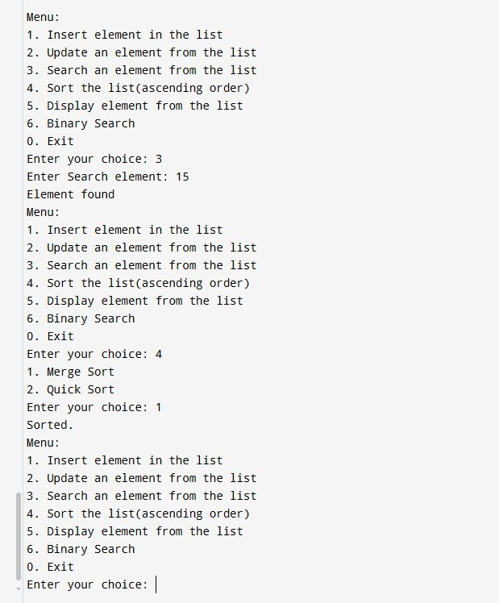

# Data Structures and Algorithms in C++

This project is a simple C++ console application that implements a singly linked list and demonstrates various sorting and searching algorithms. Users can interact with the list through a command-line menu to perform operations like inserting, updating, searching, and sorting data.

## Features

- **Linked List Management**: Create and manage a list of integers.
  - Insert new elements.
  - Update existing elements.
  - Perform a linear search for an element.
  - Display all elements in the list.
- **Sorting**: Sort the list using one of two classic algorithms:
  - Merge Sort
  - Quick Sort
- **Advanced Search**: Perform a binary search on the list's data.

## Data Structures and Algorithms

### Data Structures

- **Singly Linked List**: The core data structure used to store the elements.
- **`std::vector`**: Used as an intermediary data structure to apply sorting and binary search algorithms efficiently.

### Algorithms Implemented

- **Linear Search**: Implemented as the default search method for the linked list.
- **Merge Sort**: A divide-and-conquer algorithm for sorting the list's data.
- **Quick Sort**: An efficient in-place sorting algorithm.
- **Binary Search**: A fast search algorithm that works on sorted data.

## How to Compile and Run

### Prerequisites

You need a C++ compiler, such as G++, installed on your system.

### Compilation

Open your terminal or command prompt, navigate to the project directory, and run the following command to compile the code:

```sh
g++ Final_Project.cpp -o final_project

Copy

Insert

Execution
After successful compilation, run the executable:

./final_project

Copy

Insert

Usage
Once the program is running, you will be presented with a menu. Enter the number corresponding to the desired action.

Menu:
1. Insert element in the list
2. Update an element from the list
3. Search an element from the list
4. Sort the list(ascending order)
5. Display element from the list
6. Binary Search
0. Exit
Enter your choice:

1. Insert: Adds a new integer to the front of the list.
2. Update: Finds an existing integer in the list and replaces it with a new value.
3. Search: Performs a linear search to check if an element exists in the list.
4. Sort: Prompts you to choose between Merge Sort (1) and Quick Sort (2) to sort the entire list in ascending order.
5. Display: Prints all elements currently in the list.
6. Binary Search: First, the list data is sorted, and then a binary search is performed to find a given element.
0. Exit: Terminates the program.
```

## 🤝 Contributing

Feel free to contribute to this repository by:

1. Forking the project
2. Creating your feature branch (`git checkout -b feature/AmazingFeature`)
3. Committing your changes (`git commit -m 'Add some AmazingFeature'`)
4. Pushing to the branch (`git push origin feature/AmazingFeature`)
5. Opening a Pull Request

## Learning Path

This repository can be used as a learning resource:

1.  Start with the Looper examples to understand basic loop constructs
2.  Move to Circlet patterns for more complex nested loop applications
3.  Explore the Assortment directory for diverse problem-solving approaches


screenshot:-

  


👨‍💻 Author,

Created by Sahil Nerpagar..

